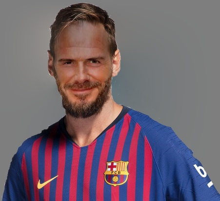

# FaceSwapper
Swap faces between two photos having a face each.

## Get Started
```sh
python main.py -s Images/clinton.jpg -d Images/Trump.jpg -p models/shape_predictor_68_face_landmarks.dat -o ClintonOnTrump.jpg 
```

| Source | Destination | Result |
| --- | --- | --- |
| |  |  |

| Source | Destination | Result |
| --- | --- | --- |
| |  |  |

| Source | Destination | Result |
| --- | --- | --- |
| |  |  |

| Source | Destination | Result |
| --- | --- | --- |
| |  |  |

| Source | Destination | Result |
| --- | --- | --- |
| |  |  |

## Install
### Requirements
* [dlib](http://dlib.net/)
* OpenCV 3
* Numpy

Note: See [requirements.txt](requirements.txt) for more details.

